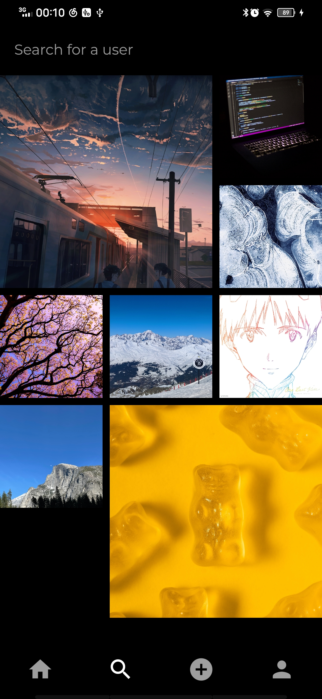
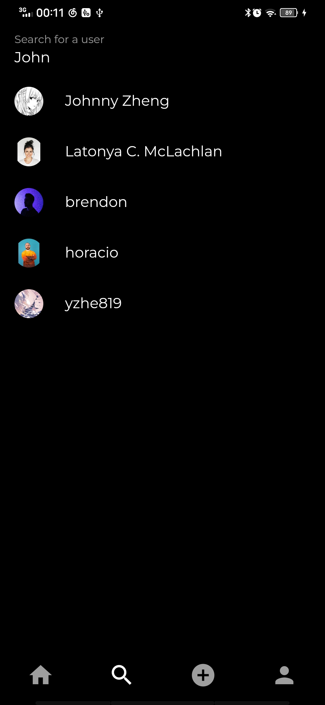
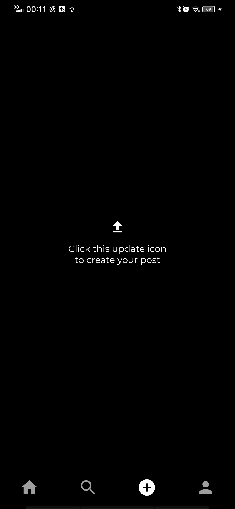
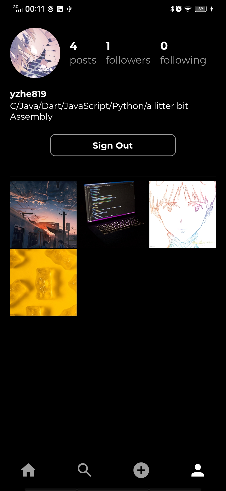
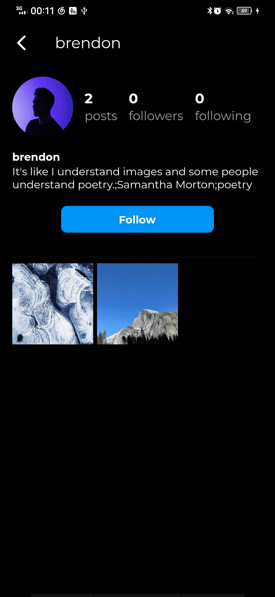
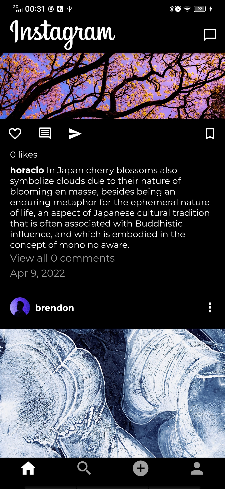
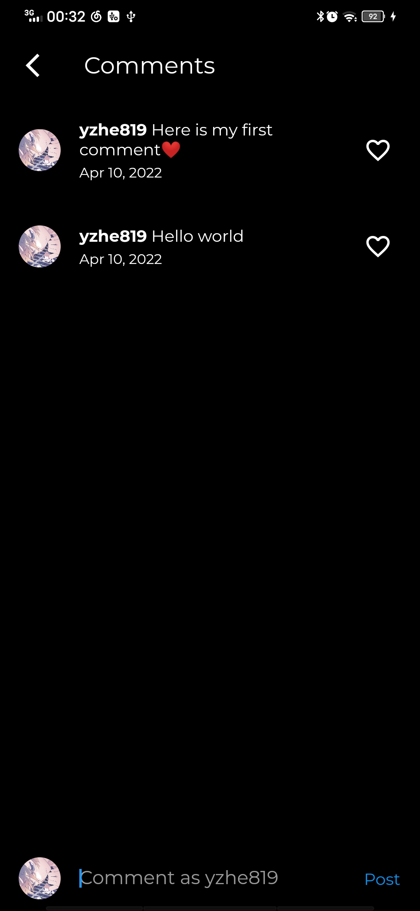
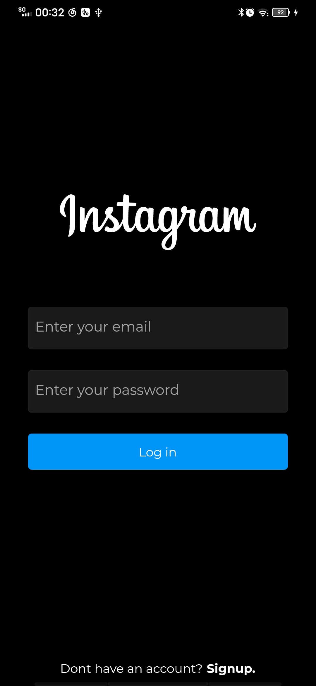

<h1 align="center">Instagram x Flutter</h1>

The Instagram clone by using flutter and firebase

## Actual Screenshot

|      |      |      |
| ---- | ---- | ---- |
|      |      |      |
|      |      |      |

## Getting Started

This project is a starting point for a Flutter application.

A few resources to get you started if this is your first Flutter project:

- [Lab: Write your first Flutter app](https://flutter.dev/docs/get-started/codelab)
- [Cookbook: Useful Flutter samples](https://flutter.dev/docs/cookbook)

For help getting started with Flutter, view our
[online documentation](https://flutter.dev/docs), which offers tutorials,
samples, guidance on mobile development, and a full API reference.

