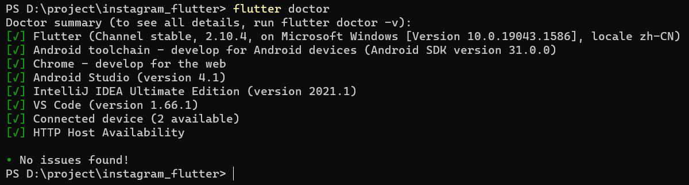
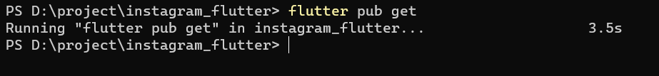
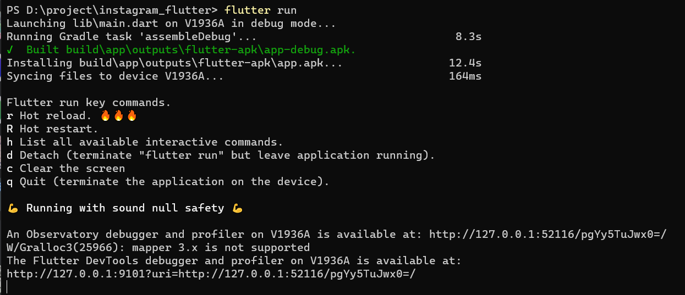

<p align="center">

</p>
<h1 align="center">Instagram x Flutter</h1>

The Instagram clone by using flutter and firebase

[](https://codemagic.io/apps/62512f57ddae835f04ad3abd/62512f57ddae835f04ad3abc/latest_build)

## Content

1. Screenshots
2. Setup development environment
3. Learn Dart and Flutter
4. About this Demo
5. How to start
5. License
5. Resource

## Screenshot

|      |      |      |
| ---- | ---- | ---- |
|      |      |      |
|      |      |      |

## Setup development environment

The first thing we need to do this set up the development environment.

- Firstly, Navigate to [Flutter install](https://docs.flutter.dev/get-started/install) and choose a suitable SDK to download.
- Don’t forget to have a check for the System Requirements.
- Then click the download button to get the Flutter Software development Kit (Flutter SDK).
- Once the zip file is downloaded, extract the **‘flutter’** folder to where you want to store this SDK (this also needs read and write permission).
- Then go the set up the system path for this SDK.
- After that, we can run.

```
flutter doctor
```
​	here is the expected output



- Once you see the above result, it means we already setup the running environment.

PS: I use stable version 2.10.4 for flutter, please check your Flutter version.

PS: Also needs to install Android Studio and toolchain for android development, which is similar to SOFTENG 306.

- More details can be founded from following website:
  - [How to Install Flutter on Windows?](https://www.geeksforgeeks.org/how-to-install-flutter-on-windows/)
  - [How to install flutter in windows step by step guide](https://www.youtube.com/watch?v=tun0HUHaDuE) 👈 recommended this video

​		

## Learn Dart and Flutter

If you want to fully study Dart, the best way is to learn from its [official website](https://dart.dev/samples). They provided multiple examples of basic Dart, which can cover most of the use cases.


No, don't run. It's no joke, and it's not complicated: Dart is a language that looks a lot like Java programs. One suggestion is to write Dart like you would write Java, except with some minor changes. Using this tutorial, which only needs about 35 minutes for Java programmer. 👉 [Intro to Dart for Java Developers](https://developers.google.com/codelabs/from-java-to-dart)


Once we have a basic idea about Dart and how it works, we can start to learn Flutter.


Flutter widgets are built using a modern framework that takes inspiration from React. The central idea is to make UI by widgets, which can create a widget tree. To study this, you can think Flutter is a specific UI framework, and we can use its component to write the running App; it should be similar to learning how to use a frontend UI framework, such as MUI, Ant Design UI.


And widgets can be classified into StatelessWidget and StatefulWidget, which depends on whether it needs a state similar to the state in React. It also provides a setState function to allow developers to update UI. Thus, writing Flutter Flutter will feel like writing a React app.


For further study, developers can also use state management in Flutter, which also is essential for mobile development. For this project, I use a package called "provider" to complete the state management, similar to the context provided in React. Other state management packages can also be used, such as [Redux](https://pub.dev/packages/redux) and [GetX](https://pub.dev/packages/get). More information can be found in this state management document 👉 [List of state management approaches](https://docs.flutter.dev/development/data-and-backend/state-mgmt/options)


Here are few helpful document resources if you want to build a your flutter project

- [Lab: Write your first Flutter app](https://flutter.dev/docs/get-started/codelab)
- [Cookbook: Useful Flutter samples](https://flutter.dev/docs/cookbook)
- [online documentation](https://flutter.dev/docs)


## About this demo

Technical stack:

- Flutter for frontend
- Firebase for backend
- cached_network_image package is used to cached all the display images
- provider is used for state management
- image_picker is used for picking the image from user's galley.
- [Codemagic](https://codemagic.io/start/) is used for CI/CD


## How to start

#### Start from the source code

- This app was only developed for Android, and the IOS device hasn't been tested yet.
- Make sure you install Flutter, Android Studio and Android toolchain first.

- Download this repo, and make should the folder name is called "instagram_flutter"
- Then run `flutter doctor ` under the root folder to check whether it has error.

- Then run `flutter pub get` which will download all the required packages (similar to npm install or yarn install)

- 

- Then connect your Android device

- Run `flutter run`, which will install the developing version into your Android device.

  


PS: I have setup the firebase, so don't need to make any change about that.


#### Download APK file

- Here is the link for APK, so just download it into your android device and do not have to install Flutter to build
- 👉 [codomagic](https://api.codemagic.io/artifacts/28f90b65-ff19-449e-99cc-c1b22d308385/f2547d44-eee3-498f-9091-1574fd943557/app-release.apk)
- 👉 check the release, which also include the APK file


## License

[MIT License](https://github.com/UOA-CS732-SE750-Students-2022/instagram_flutter/blob/main/LICENSE)


## Resource

[BRAND OVERVIEW](https://www.facebook.com/brand/resources/instagram/instagram-brand/)
